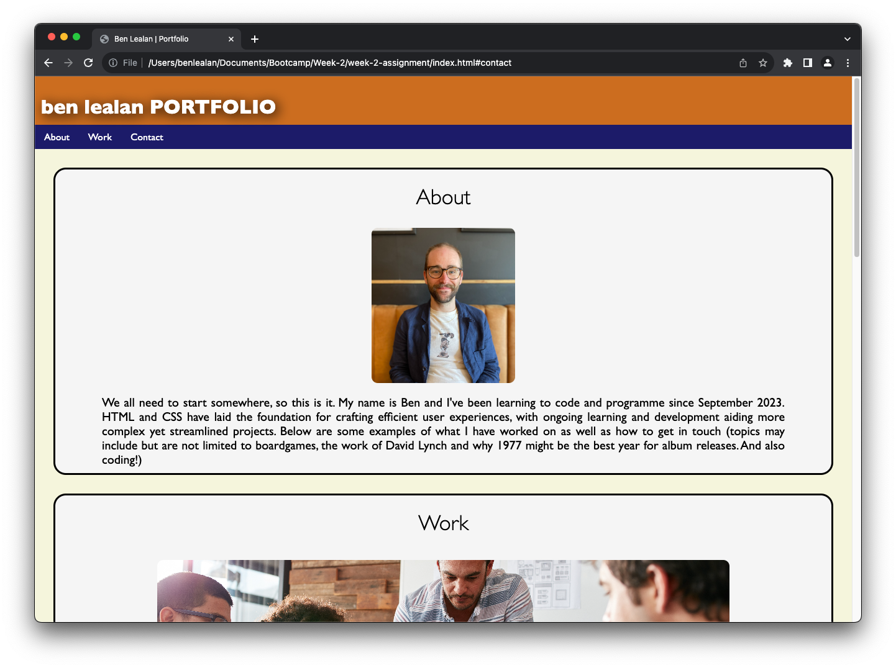
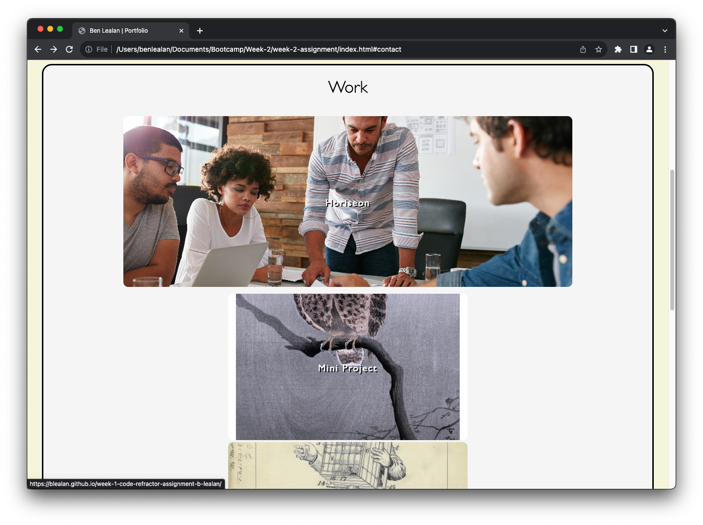
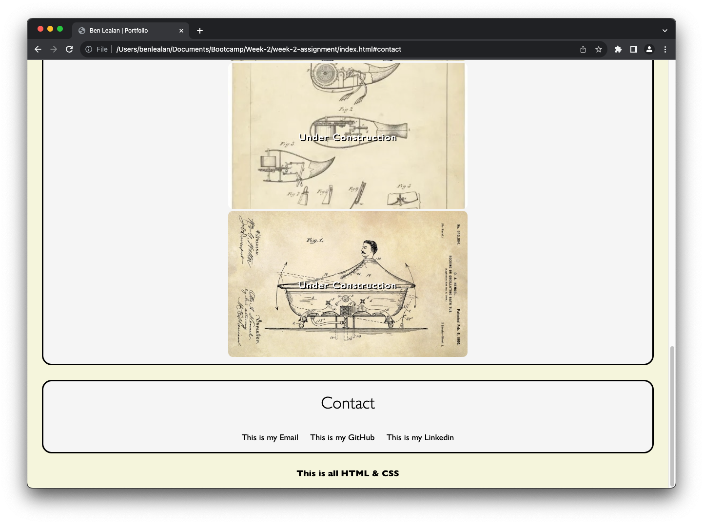

# Personal Profile - Ben Lealan

## Description

In order to showcase personal work, skills and indeed development, having an online portfolio is a vital asset for employers. As such, we were tasked with creating our own personal portfolio, coding the HTML and CSS from scratch. With the structural elements and content featured in the HTML, the real challenge for me was in CSS and wrestling with the layout of the page!

The navigation bar at the top of the screen feature hover elements to indicate they are useable links, and highlight the users current selection. The images under the Work section have text overlaying the centre of the images to title them, which I felt looked better than captions underneath the images. 

As the screen width is adjusted to the needs of the user, the elements of the page will change size and remain centered, thus maintaining the original flow of the page and keeping a consistent aesthetic style.

## Usage

Here is a link for the live version of the site:

Here are some screenshots of the site, with elements changing depending on the width of the browser window.

## Credits

Here are some resources I used to guide writing the code:

- https://www.tutorialspoint.com/html/html_email_links.htm
- https://www.w3schools.com/css/css3_object-fit.asp
- https://css-tricks.com/almanac/properties/l/letter-spacing/
- https://www.w3schools.com/css/css_navbar_horizontal.asp
- https://developer.mozilla.org/en-US/docs/Web/CSS
- https://www.w3schools.com/css/default.asp

Here are the sources for images taken from online
- https://thelongvictorian.com/2017/02/17/10-patents-for-mad-victorian-inventions/
- https://www.publicdomainpictures.net/en/view-image.php?image=366280&picture=owl-moon-art-vintage
